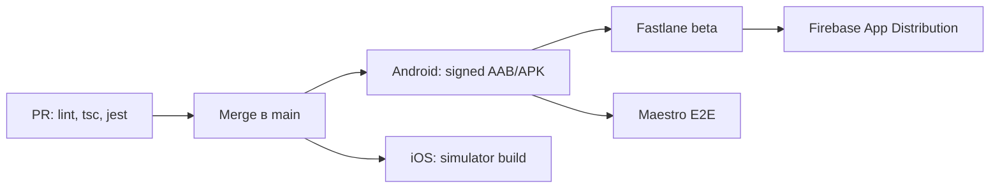
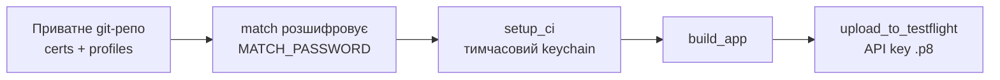

# Навчальний план: CI/CD для React Native (~14 годин)

2026-09-17 · Вадим Вознюк

## Мета і підготовка

За 7 сесій по 2 години побудувати реальний CI/CD для RN-проєкту без платних акаунтів. Кожна сесія дає робочий результат і історію для співбесіди. Флоу: спершу повністю закриваємо Android (Сесії 1-5), потім iOS (Сесія 6), потім фіналізація (Сесія 7).

**Підготовка (15 хв):**

- [x] Створити **публічний** репозиторій на GitHub: стандартні раннери, включно з macOS, для публічних репо безкоштовні
- [x] Взяти AI Collection Manager або свіжий `npx @react-native-community/cli init` (обрано цей шлях)
- [ ] ~~Expo managed → `npx expo prebuild`, щоб з'явились `android/` та `ios/`~~ (не застосовується — проєкт створено через CLI, без Expo)
- [x] Завести файл `STORIES.md` для запису кожної поломки

## Сесія 1. PR-пайплайн (2 год)

Результат: PR неможливо змерджити без зелених перевірок.

- [x] `.github/workflows/pr.yml`: тригер `pull_request`, `actions/setup-node` з `cache: 'yarn'`, кроки lint → `tsc --noEmit` → `jest`
- [x] Branch protection на `main`: мердж лише з зеленим CI
- [x] PR з навмисною TS-помилкою, переконатись, що він червоніє
- [x] `concurrency` з `cancel-in-progress: true`

**Розумієш після:** тригери, jobs/steps, кеш за lock-файлом, навіщо concurrency.

## Сесія 2. Android signing і release-білд (2 год)

Результат: підписані AAB і APK лежать в artifacts після кожного push у `main`.

- [x] Згенерувати keystore через `keytool`
- [x] `base64 -i release.keystore` → GitHub Secrets разом з паролями
- [x] `signingConfigs.release` у `build.gradle`, значення з env або gradle properties
- [x] Workflow: декодування keystore → `./gradlew bundleRelease assembleRelease` → `actions/upload-artifact`
- [x] Кеш Gradle через `gradle/actions/setup-gradle`, записати час білда до і після

**Розумієш після:** upload key проти app signing key (Play App Signing), чому keystore не комітять, AAB проти APK. Цифри «до/після кешу» ідуть у `STORIES.md`.

## Сесія 3. Fastlane + Firebase App Distribution (2 год)

Результат: після мерджу нова збірка сама приходить тобі на пошту як тестувальнику.

- [x] `Gemfile` з fastlane, запуск через `bundle exec`
- [x] `fastlane/Fastfile`, lane `android beta`: `gradle(task: "assemble", build_type: "Release")` → `firebase_app_distribution`
- [x] Проєкт у Firebase (безкоштовно), service account JSON у secrets
- [x] `versionCode` з `GITHUB_RUN_NUMBER`
- [x] Workflow викликає лише `bundle exec fastlane android beta`

**Розумієш після:** навіщо Fastlane поверх голого CI (логіка в lanes, однаково локально і на CI), автоінкремент версій.

## Сесія 4. Android: оточення dev/prod (2 год)

Результат: на телефоні одночасно стоять dev і prod версії Android-апки, push у `dev`/`main` автоматично доставляє відповідну через Firebase.

- [x] Android: `productFlavors` dev і prod з різними `applicationIdSuffix` та назвами
- [x] `react-native-config`: `.env.dev`, `.env.prod`; на CI `.env` генерується з secrets, в репо лише `.env.example`
- [x] Lanes `beta_dev` і `beta_prod` (спільна логіка через `private_lane`)
- [x] Workflow: push у `dev` → `beta_dev`, push у `main` → `beta_prod` (умова через `github.ref_name`)

**Розумієш після:** flavors проти applicationIdSuffix, як секрети потрапляють у білд і чому секрет у JS-бандлі насправді не секрет.

## Сесія 5. Android: E2E з Maestro (2 год)

Результат: E2E-тест ганяється в CI на Android-емуляторі — Android-частина CI/CD після цього повністю закрита.

- [ ] Один flow (відкрити апку → натиснути кнопку → перевірити текст) — спершу локально
- [ ] Той самий flow в CI на Android-емуляторі (`reactivecircus/android-emulator-runner`)

**Розумієш після:** чим E2E відрізняється від unit-тестів (jest) у пайплайні, чому емулятор у CI повільний і коли це виправдано.

## Сесія 6. iOS на CI без $99 (2 год)

Результат: dev/prod схеми на iOS, зелений iOS-білд під симулятор і схема signing, яку пояснюєш за 2 хвилини без підглядання.

- [ ] iOS: окрема scheme і build configuration для dev (один раз руками, в Xcode — `Debug Dev`/`Release Dev` + scheme `FastlaneLearningDev`)
- [ ] Job на `macos-latest`, пінінг Xcode через `maxim-lobanov/setup-xcode`
- [ ] Кеш `ios/Pods` за ключем `Podfile.lock`, `bundle exec pod install`
- [ ] `xcodebuild -workspace ... -scheme ... -sdk iphonesimulator -configuration Release CODE_SIGNING_ALLOWED=NO`
- [ ] Запуск лише на push у `main` (macOS-хвилини в приватних репо множаться на 10)
- [ ] Теорія, 40 хв: документація `fastlane match` і App Store Connect API key

Потік signing на CI, який треба вміти розповісти:

**Розумієш після:** flavors (Android) проти schemes/build configurations (iOS); чому macOS-хвилини дорогі, чому Xcode пінять, чому API key кращий за Apple ID (2FA), як працює match.

## Сесія 7. OTA і фіналізація (2 год)

Результат: README, який працює як доказ на співбесіді.

- [ ] **OTA, 30 хв, теорія:** App Center закрито; альтернативи EAS Update і self-hosted CodePush; `runtimeVersion` і правило «нативна зміна = стор-реліз»
- [ ] **README, 45 хв:** діаграма пайплайна + розділ «Проблеми, які я вирішив» з `STORIES.md`

Якщо часу нема, сесію можна скоротити до теорії OTA і README (вона й так лише про це).

## Результат і підготовка до співбесіди

Після ~14 годин: публічне репо з workflows (PR, Android beta dev/prod, iOS build), Fastfile (Android+iOS lanes) і 5+ реальних історій про поломки.

**Пріоритети:** сесії 1–4 обов'язкові (весь Android-цикл закритий), 5–6 дуже бажані, 7 можна скоротити.

**Формат історії в `STORIES.md`:** що зламалось → як знайшов причину → що зробив → цифри.

**Питання, які реально ставлять:**

| Питання | Де закриваєш |
| --- | --- |
| Як влаштовано iOS signing на CI і навіщо match? | Сесія 6 |
| Як безпечно зберігати keystore і секрети? | Сесії 2, 4 |
| Що робити, якщо втратили Android-ключ? | Сесія 2 |
| Як прискорити білд? | Сесії 1, 2, 6 |
| Коли OTA, а коли стор-реліз? | Сесія 7 |
| Як ведете версіонування? | Сесія 3 |
| Як організувати dev/staging/prod? | Сесія 4 |
| EAS, Bitrise чи GitHub Actions: які trade-offs? | Сесії 3, 6 |

**Як економити час:**

- Не вилизуй YAML: працює, то далі.
- Застряг довше 30 хв → скидай лог і розбирай з Claude.

**Формулювання на співбесіді:** «У комерційних проєктах працював з готовим CI, свій пайплайн налаштував з нуля, ось репо».
